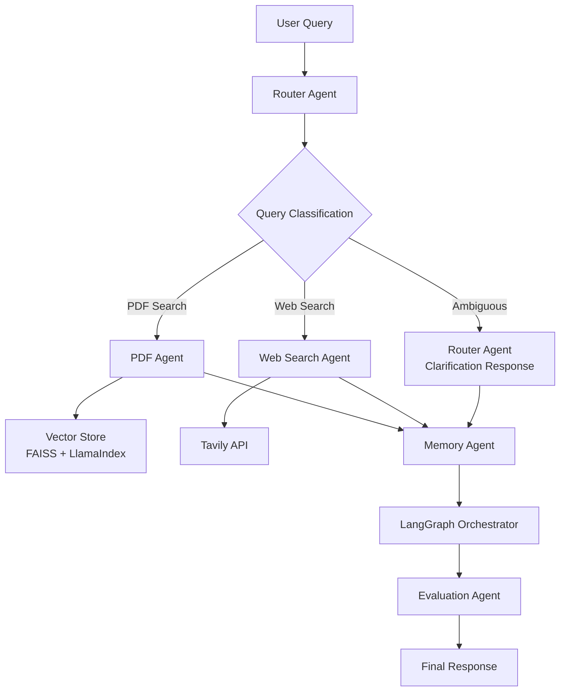

# Chat with PDF - Multi-Agent RAG System

A sophisticated multi-agent system that intelligently routes queries between PDF document search and web search, with advanced conversation memory and query disambiguation.

## 🏗️ Architecture Overview

This system uses a **6-agent architecture** orchestrated by LangGraph to provide intelligent question-answering capabilities. Note that clarification functionality is handled by the Router Agent itself, not a separate agent:



### Core Agents (6 Total)

The system employs exactly **6 agents**, with the Router Agent handling both routing and clarification functions:

#### 🧭 Router Agent

- **Purpose**: Intelligent query classification, routing, and clarification generation
- **Capabilities**:
  - Distinguishes between PDF-searchable research questions and current events
  - Detects ambiguous queries and generates structured clarification requests
  - Uses both LLM classification and pattern-based detection
  - Handles clarification without routing to other agents
- **Decision Logic**: Web search patterns → Ambiguous patterns → LLM classification
- **Clarification**: Provides context-specific follow-up questions for vague queries

#### 📚 PDF Agent  

- **Purpose**: RAG-based document retrieval and synthesis
- **Capabilities**:
  - Semantic search through 4 Text-to-SQL research papers (138 chunks)
  - Context-aware answer generation with source citations
  - Out-of-scope detection for non-academic queries
- **Vector Store**: FAISS with LlamaIndex embeddings

#### 🌐 Web Search Agent

- **Purpose**: Real-time information retrieval
- **Capabilities**:
  - Current events and recent developments
  - Company announcements and product releases
  - Live data and time-sensitive information
- **API**: Tavily search with content synthesis

#### 🧠 Memory Agent

- **Purpose**: Session-based conversation history
- **Capabilities**:
  - Multi-turn conversation context
  - Session isolation and management
  - Metadata tracking for query types and confidence
- **Storage**: In-memory with session persistence

#### 🎯 Evaluation Agent  

- **Purpose**: Response quality assessment
- **Capabilities**:
  - Relevance scoring for retrieved documents
  - Answer completeness evaluation
  - Confidence calibration and quality metrics
- **Output**: Overall confidence scores and quality ratings

#### 🎼 Orchestrator Agent

- **Purpose**: LangGraph-based workflow coordination
- **Capabilities**:
  - State management across agent interactions
  - Error handling and fallback mechanisms
  - Response finalization and memory updates
- **Framework**: LangGraph state machine

## 🚀 How to Run Locally

### Prerequisites

- Docker and Docker Compose
- API Keys for:
  - Google AI Studio (Gemini)
  - Tavily Search API

### Quick Start

1. **Clone and Setup**

   ```bash
   git clone <repository-url>
   cd chat-with-pdf
   ```

2. **Environment Configuration**

   ```bash
   cp env.example .env
   # Edit .env with your API keys:
   # GOOGLE_API_KEY=your_google_ai_studio_key
   # TAVILY_API_KEY=your_tavily_api_key
   ```

3. **Build and Run**

   ```bash
   docker-compose up --build
   ```

4. **Verify Setup**

   ```bash
   # Check if service is running
   curl http://localhost:8000/health
   
   # Check vector database status
   ./inject.sh stats
   ```

### 📄 PDF Management

The system comes pre-loaded with 4 Text-to-SQL research papers. To manage the vector database:

```bash
# View current database status
./inject.sh stats

# Add new PDFs (with safety checks)
./inject.sh default

# Force append new data
./inject.sh default --force

# Clear existing data
./inject.sh clear

# View help
./inject.sh help
```

### 🧪 Testing the System

#### 1. Ambiguous Queries

```bash
curl -X POST http://localhost:8000/ask \
  -H "Content-Type: application/json" \
  -d '{"question": "How many examples are enough for good accuracy?"}'

# Expected: query_type: "ambiguous" with clarification request
```

#### 2. PDF-Only Queries  

```bash
curl -X POST http://localhost:8000/ask \
  -H "Content-Type: application/json" \
  -d '{"question": "Which prompt template gave the highest zero-shot accuracy on Spider in Zhang et al. (2024)?"}'

# Expected: query_type: "pdf_search" with research-based answer
```

#### 3. Out-of-Scope Queries

```bash
curl -X POST http://localhost:8000/ask \
  -H "Content-Type: application/json" \
  -d '{"question": "What did OpenAI release this month?"}'

# Expected: query_type: "web_search" with current information
```

#### 4. Clear Memory

```bash
curl -X POST http://localhost:8000/clear \
  -H "Content-Type: application/json" \
  -d '{"session_id": "your_session_id"}'
```

## 📊 Current Performance

- **Vector Database**: 4 research papers, 138 document chunks
- **Response Time**: ~3-8 seconds depending on query complexity
- **Accuracy**: High precision on academic Text-to-SQL questions
- **Coverage**: Real-time web search for current events

## 🔮 Future Improvements

### 1. Enhanced Intelligence

- **Multi-Modal Support**: Add support for images, tables, and charts in PDFs
- **Advanced RAG**: Implement hybrid search (dense + sparse), re-ranking, and query expansion
- **Reasoning Chains**: Add Chain-of-Thought and Tree-of-Thought reasoning for complex queries
- **Self-Reflection**: Implement agent self-evaluation and error correction

### 2. Scalability & Performance

- **Distributed Architecture**: Kubernetes deployment with horizontal scaling
- **Caching Layer**: Redis for query caching and session management
- **Async Processing**: Background indexing and streaming responses
- **Load Balancing**: Multiple agent instances with intelligent routing

### 3. User Experience

- **Web Interface**: React-based chat UI with source highlighting
- **Mobile App**: Native mobile applications for on-the-go access
- **Voice Integration**: Speech-to-text and text-to-speech capabilities
- **Real-time Collaboration**: Multi-user document analysis sessions

### 4. Enterprise Features

- **Multi-Tenancy**: Isolated document collections per organization
- **Advanced Security**: OAuth2, RBAC, and audit logging
- **Custom Models**: Fine-tuned models for domain-specific use cases
- **Analytics Dashboard**: Usage metrics, performance monitoring, and insights

### 5. Data & Integration

- **Universal Connectors**: Google Drive, SharePoint, Confluence, Notion
- **Live Document Sync**: Real-time updates from connected sources
- **Database Integration**: Direct SQL database querying capabilities
- **API Ecosystem**: Extensive REST/GraphQL APIs for third-party integrations

### 6. Advanced AI Capabilities

- **Multimodal LLMs**: GPT-4V, Claude 3, and specialized vision models
- **Agent Specialization**: Domain-specific agents (legal, medical, technical)
- **Automated Workflows**: Document processing pipelines and batch operations
- **Knowledge Graph**: Entity extraction and relationship mapping

## 🛠️ Technical Stack

- **Backend**: FastAPI (Python)
- **AI/ML**: LangChain, LlamaIndex, Google Gemini, FAISS
- **Orchestration**: LangGraph state machines
- **Search**: Tavily API for web search
- **Containerization**: Docker & Docker Compose
- **Vector Store**: FAISS with persistent storage
- **Embeddings**: Google AI embeddings via LlamaIndex

## 📁 Project Structure

``` text
chat-with-pdf/
├── src/
│   ├── agents/           # Individual agent implementations
│   ├── services/         # Core services (LLM, Vector Store)
│   ├── core/            # Configuration and models
│   └── api/             # FastAPI endpoints
├── data/
│   ├── pdfs/            # Source PDF documents
│   └── vector_store/    # FAISS indices and metadata
├── scripts/             # Utility scripts
├── docker-compose.yml   # Container orchestration
├── Dockerfile          # Application container
└── inject.sh           # PDF management script
```
