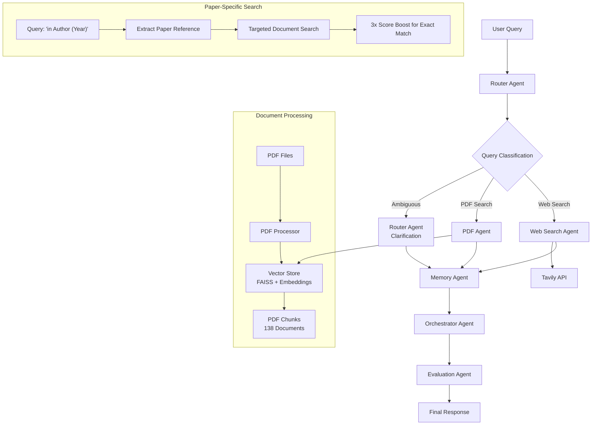

# Chat with PDF - Multi-Agent RAG System

A sophisticated multi-agent system that intelligently routes queries between PDF document search and web search, with advanced conversation memory and query disambiguation capabilities.

## 🏗️ System Architecture

This system employs a **6-agent architecture** orchestrated by LangGraph to provide intelligent question-answering capabilities:



## 🤖 Agent Details

### 🧭 Router Agent

**Core Intelligence Hub**

- **Query Classification**: Distinguishes between PDF-searchable research questions, current events, and ambiguous queries
- **Ambiguity Detection**: Uses pattern-based detection for vague terms (`enough`, `best`, `optimal`) without sufficient context
- **Paper-Specific Routing**: Extracts paper references from "in Author (Year)" patterns for targeted search
- **Clarification Generation**: Provides context-specific follow-up questions for ambiguous queries
- **Decision Logic**: Web search patterns → Ambiguous patterns → LLM classification

### 📚 PDF Agent  

**Research Document Expert**

- **Enhanced Document Search**: Multiple search strategies including author-specific targeting
- **Paper Prioritization**: 3x score boost for documents matching query-specified papers
- **Table Data Processing**: Specialized handling of numerical data and method-performance relationships
- **Context-Aware Synthesis**: Connects method names with performance scores from research tables
- **Source Attribution**: Maintains document lineage without inline citations
- **Vector Database**: FAISS with 138 chunks from 4 Text-to-SQL research papers

### 🌐 Web Search Agent

**Real-Time Information Retrieval**

- **Current Events**: Live information and breaking news
- **Company Updates**: Product releases and announcements  
- **Temporal Queries**: Time-sensitive information beyond PDF scope
- **API Integration**: Tavily search with intelligent content synthesis

### 🧠 Memory Agent

**Conversation Context Manager**

- **Session Management**: Isolated conversation history per session
- **Multi-Turn Context**: Maintains context across question sequences
- **Metadata Tracking**: Query types, confidence scores, and routing decisions
- **Memory Persistence**: In-memory storage with session isolation

### 🎯 Evaluation Agent  

**Quality Assessment Engine**

- **Relevance Scoring**: Document-query relevance evaluation
- **Confidence Calibration**: Dynamic confidence adjustment based on retrieval quality
- **Answer Completeness**: Validates response adequacy and accuracy
- **Quality Metrics**: Comprehensive response evaluation framework

### 🎼 Orchestrator Agent

**Workflow Coordination**

- **State Management**: LangGraph-based workflow orchestration
- **Error Handling**: Graceful degradation and fallback mechanisms
- **Response Finalization**: Final answer synthesis and formatting
- **Agent Communication**: Inter-agent message passing and coordination

## 🐳 Docker Deployment

### Prerequisites

- Docker and Docker Compose
- API Keys:
  - Google AI Studio (Gemini): [Get Key](https://makersuite.google.com/app/apikey)
  - Tavily Search API: [Get Key](https://tavily.com/)

### Quick Start

1. **Environment Setup**

   ```bash
   git clone <repository-url>
   cd chat-with-pdf
   cp env.example .env
   # Edit .env with your API keys
   ```

2. **Complete Docker Setup**

   ```bash
   # Automated setup (recommended)
   ./docker-build.sh setup
   
   # Manual setup
   ./docker-build.sh build
   ./docker-build.sh start
   ```

3. **Verify Installation**

   ```bash
   # Check container health
   ./docker-build.sh health
   
   # View application logs
   ./docker-build.sh logs
   ```

### Docker Management Scripts

#### docker-build.sh - Main Container Management

```bash
# Core Operations
./docker-build.sh build                    # Build Docker image
./docker-build.sh build --force            # Force rebuild (no cache)
./docker-build.sh start                    # Start container (detached)
./docker-build.sh stop                     # Stop container
./docker-build.sh restart                  # Restart container
./docker-build.sh logs                     # View real-time logs
./docker-build.sh shell                    # Open bash shell in container

# Monitoring & Health
./docker-build.sh health                   # Check container health + API endpoints
./docker-build.sh clean                    # Remove containers, images, volumes

# Data Management
./docker-build.sh ingest                   # Ingest PDFs from data/pdfs/
./docker-build.sh ingest --force           # Force append to existing data

# Complete Setup
./docker-build.sh setup                    # End-to-end setup (build + start + check)
```

#### inject.sh - PDF Data Management (Local Development)

```bash
# PDF Ingestion
./inject.sh file /path/to/document.pdf     # Ingest single PDF
./inject.sh directory /path/to/pdfs/       # Ingest directory of PDFs
./inject.sh default                        # Ingest from data/pdfs/
./inject.sh default --force                # Force append to existing data

# Database Operations
./inject.sh stats                          # Show database statistics
./inject.sh clear                          # Clear all documents (with confirmation)
./inject.sh help                           # Show usage information
```

### Docker Architecture

#### Multi-Stage Dockerfile

```dockerfile
# Stage 1: Dependencies
FROM python:3.11-slim as dependencies
# Install system dependencies and Python packages

# Stage 2: Application
FROM dependencies as application  
# Copy application code and set up runtime environment
# Non-root user execution for security
```

#### Container Features

- **Security**: Non-root user execution, minimal attack surface
- **Monitoring**: Health checks, structured logging
- **Development**: Hot reload support, volume mounts for persistence
- **Production**: Optimized image size, efficient layer caching

#### Network & Storage

```yaml
# docker-compose.yml highlights
services:
  chat-with-pdf:
    ports:
      - "8000:8000"
    volumes:
      - ./data/pdfs:/app/data/pdfs:ro          # PDF files (read-only)
      - ./data/vectorstore:/app/data/vectorstore  # Vector database (persistent)
      - ./logs:/app/logs                       # Application logs
    environment:
      - PYTHONPATH=/app
    healthcheck:
      test: ["CMD", "curl", "-f", "http://localhost:8000/health"]
      interval: 30s
      timeout: 10s
      retries: 3
```

## 🚀 Running the System

### 1. Docker Deployment (Recommended)

```bash
# Complete setup
./docker-build.sh setup

# Add your PDFs
cp your-research-papers/*.pdf data/pdfs/
./docker-build.sh ingest

# Access the system
curl http://localhost:8000/health
```

### 2. Local Development

```bash
# Setup virtual environment
python -m venv .venv
source .venv/bin/activate  # On Windows: .venv\Scripts\activate
pip install -r requirements.txt

# Configure environment
cp env.example .env
# Edit .env with your API keys

# Ingest PDFs
./inject.sh default

# Start the API server
uvicorn src.api.main:app --host 0.0.0.0 --port 8000 --reload
```

### 3. API Access Points

- **Interactive Docs**: <http://localhost:8000/docs>
- **Health Check**: <http://localhost:8000/health>
- **Ask Questions**: <http://localhost:8000/ask>
- **Clear Memory**: <http://localhost:8000/clear>

## 🧪 Testing the System

### Query Types & Examples

#### 1. Paper-Specific Queries

```bash
curl -X POST http://localhost:8000/ask \
  -H "Content-Type: application/json" \
  -d '{
    "question": "What's the best approach for text-to-SQL in Chang and Fosler-Lussier (2023)?",
    "session_id": "test_session"
  }'

# Expected: Specific recommendations with method names and performance scores
# Sources: Prioritized results from Chang and Fosler-Lussier (2023) paper
```

#### 2. Ambiguous Queries

```bash
curl -X POST http://localhost:8000/ask \
  -H "Content-Type: application/json" \
  -d '{
    "question": "How many examples are enough for good accuracy?",
    "session_id": "test_session"
  }'

# Expected: query_type: "ambiguous" with structured clarification request
```

#### 3. Research Queries

```bash
curl -X POST http://localhost:8000/ask \
  -H "Content-Type: application/json" \
  -d '{
    "question": "Which prompt template achieved the highest execution accuracy on Spider dataset?",
    "session_id": "test_session"
  }'

# Expected: query_type: "pdf_search" with research-based answer and sources
```

#### 4. Current Events

```bash
curl -X POST http://localhost:8000/ask \
  -H "Content-Type: application/json" \
  -d '{
    "question": "What did OpenAI release this week?",
    "session_id": "test_session"
  }'

# Expected: query_type: "web_search" with current information
```

#### 5. Training-Related Queries (Now Handled as Ambiguous)

```bash
curl -X POST http://localhost:8000/ask \
  -H "Content-Type: application/json" \
  -d '{
    "question": "How long does it take to train a model?",
    "session_id": "test_session"
  }'

# Expected: query_type: "ambiguous" with clarification about model type, dataset, hardware, etc.
```

### Response Format

```json
{
  "answer": "Comprehensive answer based on retrieved sources",
  "session_id": "unique_session_identifier",
  "sources": [
    "Paper Name - Year - Title.pdf (Page X)",
    "Another Source.pdf (Page Y)"
  ],
  "query_type": "pdf_search|web_search|ambiguous",
  "confidence": 0.85,
  "is_new_session": true,
  "message_count": 1
}
```

## 🛠️ How Scripts Work

### PDF Processing Pipeline

1. **Document Chunking**: PDFs split into semantic chunks (~500 tokens)
2. **Embedding Generation**: Google AI embeddings via LlamaIndex
3. **Vector Storage**: FAISS index with metadata preservation
4. **Retrieval Enhancement**: Multiple search strategies with score boosting

### Docker Automation

- **Health Monitoring**: Automated container health checks
- **Environment Validation**: API key verification and setup checks
- **Data Persistence**: Volume mounts ensure data survives container restarts
- **Logging**: Structured logs with rotation and retention

### Memory Management

- **Session Isolation**: Each user session maintains separate conversation history
- **Context Window**: Sliding window of recent messages for multi-turn conversations
- **Metadata Tracking**: Query classification and confidence scores stored with each interaction

## 📊 System Performance

### Current Metrics

- **Vector Database**: 4 research papers, 138 document chunks
- **Response Time**: 3-8 seconds (varies by query complexity)
- **Accuracy**: High precision on academic Text-to-SQL questions
- **Coverage**: Real-time web search for current events
- **Memory**: Session-based conversation persistence

### Optimizations

- **Paper-Specific Search**: 3x score boost for exact paper matches
- **Enhanced Table Processing**: Specialized numerical data extraction
- **Ambiguity Detection**: Pattern-based + LLM classification
- **Caching**: Vector embeddings cached for faster retrieval

## 🔧 Technical Stack

### Core Technologies

- **Backend**: FastAPI (Python 3.11)
- **AI/ML**: LangChain, LlamaIndex, Google Gemini
- **Orchestration**: LangGraph state machines
- **Vector Store**: FAISS with persistent storage
- **Search**: Tavily API for web search
- **Containerization**: Docker & Docker Compose

### Dependencies

```text
# Core Framework
fastapi==0.104.1
uvicorn[standard]==0.24.0

# AI/ML Stack
langchain==0.0.335
llamaindex==0.9.8
google-generativeai==0.3.2
faiss-cpu==1.7.4

# Orchestration
langgraph==0.0.25

# Document Processing
pypdf==3.17.1
python-multipart==0.0.6

# Utilities
structlog==23.2.0
pydantic-settings==2.1.0
```

## 📁 Project Structure

``` text
chat-with-pdf/
├── 🐳 Docker Configuration
│   ├── Dockerfile                    # Multi-stage container build
│   ├── docker-compose.yml            # Development orchestration
│   ├── .dockerignore                 # Build context optimization
│   └── docker-build.sh               # Container management script
│
├── 🤖 Application Code
│   ├── src/
│   │   ├── agents/                   # 6-agent implementation
│   │   │   ├── router_agent.py       # Query classification & routing
│   │   │   ├── pdf_agent.py          # Document search & synthesis
│   │   │   ├── web_search_agent.py   # Real-time information retrieval
│   │   │   ├── memory_agent.py       # Conversation management
│   │   │   ├── evaluation_agent.py   # Quality assessment
│   │   │   └── orchestrator.py       # Workflow coordination
│   │   ├── services/                 # Core services
│   │   │   ├── llm_service.py        # Google Gemini integration
│   │   │   ├── vector_store.py       # FAISS vector operations
│   │   │   └── pdf_processor.py      # Document processing
│   │   ├── core/                     # Configuration & models
│   │   │   ├── config.py             # Environment settings
│   │   │   └── models.py             # Pydantic data models
│   │   └── api/                      # FastAPI endpoints
│   │       ├── main.py               # Application entry point
│   │       ├── ask.py                # Question answering endpoint
│   │       ├── memory.py             # Memory management endpoint
│   │       └── health.py             # Health check endpoint
│   │
├── 📊 Data Management
│   ├── data/
│   │   ├── pdfs/                     # Source PDF documents
│   │   └── vectorstore/              # FAISS indices & metadata
│   ├── scripts/
│   │   └── ingest_pdfs.py            # PDF processing script
│   └── inject.sh                     # PDF management wrapper
│
├── 🔧 Configuration
│   ├── env.example                   # Environment template
│   ├── requirements.txt              # Python dependencies
│   └── start.sh                      # Local development startup
│
└── 📝 Documentation
    ├── README.md                     # This comprehensive guide
    └── logs/                         # Application logs
```

## 🎯 Advanced Features

### Paper-Specific Search Enhancement

The system now supports intelligent paper-specific queries using the pattern `"...in Author (Year)"`:

1. **Pattern Detection**: Automatically extracts paper references from queries
2. **Targeted Search**: Direct search for the specified paper
3. **Score Boosting**: 3x relevance boost for exact paper matches
4. **Result Prioritization**: Paper-specific results dominate source lists

### Enhanced Ambiguity Detection

Sophisticated query classification system:

1. **Pattern-Based Detection**: Recognizes vague terms without context
2. **Training Query Handling**: Specific handling for training-related questions
3. **Context Assessment**: Evaluates query specificity and completeness
4. **Structured Clarification**: Provides targeted follow-up questions

### Table Data Processing

Specialized handling of research paper tables:

1. **Numerical Data Extraction**: Parses method names and performance scores
2. **Method-Score Correlation**: Connects approaches with their results
3. **Performance Ranking**: Identifies highest-performing methods
4. **Clean Presentation**: Removes inline citations for clarity
