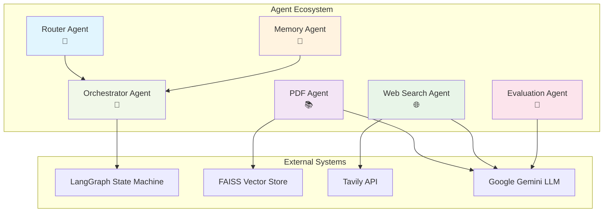
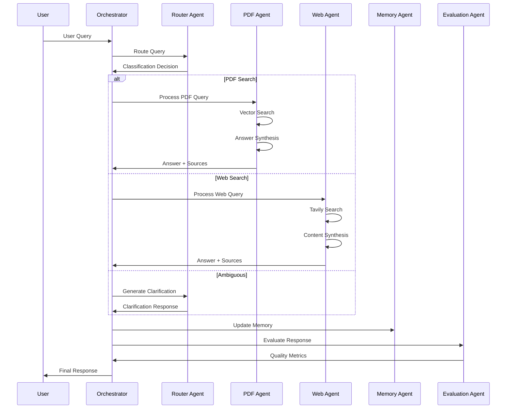

# Multi-Agent Architecture - Agents Documentation

This directory contains the core agents that power the Chat with PDF multi-agent system. Each agent has a specific responsibility and they work together through LangGraph orchestration to provide intelligent document-based question answering.

## 🏗️ Agent Architecture Overview

The system employs a **6-agent architecture** where each agent specializes in a particular aspect of the question-answering pipeline:



## 🤖 Individual Agent Specifications

### 1. Router Agent (`router_agent.py`)

**Primary Responsibility**: Query classification, routing decisions, and clarification generation

#### Key Components

- **LLM-based Classification**: Uses Google Gemini to analyze query intent
- **Pattern-based Detection**: Rule-based detection for obvious patterns
- **Confidence Thresholding**: Applies confidence thresholds to routing decisions
- **Clarification Generation**: Produces structured follow-up questions for ambiguous queries

#### LangChain Integration

```python
# Uses LLM service for classification
classification = await llm_service.classify_query_intent(question)

# Pattern-based detection with confidence scoring
if confidence < self.confidence_threshold:
    query_type = QueryType.AMBIGUOUS
```

#### Decision Logic

1. **Web Search Patterns** (highest priority) → temporal indicators + companies
2. **Ambiguous Patterns** (second priority) → vague terms without context
3. **LLM Classification** (fallback) → semantic understanding

#### Outputs

- `RouterDecision` with query type, confidence, reasoning, and clarification needs

---

### 2. PDF Agent (`pdf_agent.py`)

**Primary Responsibility**: RAG-based document retrieval and answer synthesis

#### Key Components

- **Vector Store Integration**: FAISS with LlamaIndex for semantic search
- **Context Retrieval**: Retrieves relevant document chunks with similarity scoring
- **Answer Synthesis**: Uses LLM to generate coherent answers from retrieved context
- **Source Attribution**: Provides precise citations with page numbers

#### LangChain Integration

```python
# Vector store querying through LlamaIndex
retriever = self.vector_store.as_retriever(
    similarity_top_k=top_k,
    similarity_threshold=0.7
)

# LLM-powered answer synthesis
answer = await llm_service.synthesize_answer(
    question=question,
    context=context,
    sources=sources,
    chat_history=chat_history
)
```

#### RAG Pipeline

1. **Query Processing** → embed user question
2. **Similarity Search** → retrieve top-k relevant chunks
3. **Context Assembly** → combine chunks with metadata
4. **Answer Generation** → LLM synthesis with source citations
5. **Relevance Filtering** → ensure answer quality

#### Out-of-Scope Detection

- Identifies when queries can't be answered from academic papers
- Suggests alternative query approaches

---

### 3. Web Search Agent (`web_search_agent.py`)

**Primary Responsibility**: Real-time information retrieval for current events

#### Key Components

- **Query Enhancement**: Optimizes search queries for better results
- **Tavily API Integration**: Performs web searches with content retrieval
- **Result Processing**: Filters and ranks search results
- **Content Synthesis**: Generates coherent answers from web sources

#### LangChain Integration

```python
# Enhanced query generation
enhanced_query = await llm_service.enhance_web_search_query(question)

# Web search through Tavily
search_results = await self.tavily_client.search(
    query=enhanced_query,
    search_depth="advanced",
    max_results=5
)

# LLM-powered content synthesis
answer = await llm_service.generate_simple_response(web_prompt)
```

#### Search Pipeline

1. **Query Enhancement** → improve search terms for web APIs
2. **Multi-source Search** → Tavily API with advanced depth
3. **Content Extraction** → extract relevant snippets from results
4. **Synthesis** → LLM-generated coherent response
5. **Source Linking** → maintain links to original sources

#### Use Cases

- Current events and breaking news
- Company announcements and product releases
- Time-sensitive information not in academic papers

---

### 4. Memory Agent (`memory_agent.py`)

**Primary Responsibility**: Conversation history and session management

#### Key Components

- **Session Isolation**: Separate conversation histories per session
- **Message Management**: Stores user and assistant messages with metadata
- **Context Provision**: Supplies relevant history for multi-turn conversations
- **Memory Limits**: Implements configurable message limits with cleanup

#### LangChain Integration

```python
# Integration with ChatMessage format
from langchain.schema import HumanMessage, AIMessage

# Conversation history management
chat_history = [
    HumanMessage(content=msg.content) if msg.role == "user" 
    else AIMessage(content=msg.content)
    for msg in messages
]
```

#### Memory Structure

```python
@dataclass
class ChatMessage:
    role: str          # "user" or "assistant"
    content: str       # message content
    timestamp: datetime
    metadata: Dict[str, Any]  # query_type, confidence, sources, etc.
```

#### Session Features

- **Thread Safety**: Concurrent session handling
- **Metadata Tracking**: Query types, confidence scores, source information
- **Cleanup Logic**: Automatic old message removal
- **History Retrieval**: Contextual conversation access

---

### 5. Evaluation Agent (`evaluation_agent.py`)

**Primary Responsibility**: Answer quality assessment and confidence calibration

#### Key Components

- **Relevance Scoring**: Measures how well answers match questions
- **Completeness Assessment**: Evaluates answer thoroughness
- **Confidence Calibration**: Adjusts confidence based on multiple factors
- **Quality Rating**: Provides structured quality metrics

#### LangChain Integration

```python
# LLM-based evaluation
evaluation_prompt = f"""Evaluate this Q&A interaction:
Question: {question}
Answer: {answer}
Sources: {sources}

Assess: relevance, completeness, accuracy, clarity"""

evaluation = await llm_service.generate_simple_response(evaluation_prompt)
```

#### Evaluation Metrics

- **Relevance Score** (0.0-1.0): How well answer addresses question
- **Completeness Score** (0.0-1.0): How thorough the answer is
- **Source Quality** (0.0-1.0): Reliability of cited sources
- **Overall Confidence** (0.0-1.0): Combined confidence metric

#### Quality Factors

- Retrieval confidence from vector search
- LLM generation confidence
- Source diversity and quality
- Answer length and detail appropriateness

---

### 6. Orchestrator Agent (`orchestrator.py`)

**Primary Responsibility**: LangGraph-based workflow coordination and state management

#### Key Components

- **State Machine Management**: LangGraph workflow orchestration
- **Agent Coordination**: Routes between different processing agents
- **Error Handling**: Manages failures and provides fallback responses
- **Response Finalization**: Assembles final responses with metadata

#### LangGraph Integration

```python
from langgraph.graph import StateGraph, END

# Build the workflow graph
workflow = StateGraph(AgentState)

# Add nodes for each processing step
workflow.add_node("route_query", self._route_query_node)
workflow.add_node("pdf_search", self._handle_pdf_search_node)
workflow.add_node("web_search", self._handle_web_search_node)
workflow.add_node("ambiguous", self._handle_ambiguous_node)
workflow.add_node("finalize", self._finalize_response_node)

# Define conditional routing
workflow.add_conditional_edges(
    "route_query",
    self._routing_condition,
    {
        "pdf_search": "pdf_search",
        "web_search": "web_search", 
        "ambiguous": "ambiguous"
    }
)
```

#### State Management

```python
@dataclass
class AgentState:
    question: str
    session_id: str
    query_type: Optional[QueryType] = None
    final_answer: Optional[str] = None
    sources: List[str] = field(default_factory=list)
    confidence: float = 0.0
    error: Optional[str] = None
```

#### Workflow Steps

1. **Query Routing** → Router Agent determines processing path
2. **Specialized Processing** → PDF/Web/Ambiguous handling
3. **Memory Integration** → Conversation history management
4. **Evaluation** → Quality assessment and confidence scoring
5. **Response Finalization** → Final answer assembly and metadata

---

## 🔄 Agent Orchestration Flow

### Complete Processing Pipeline



### Key Integration Points

#### 1. **LangChain Components Used:**

- **LLM Integration**: Google Gemini through langchain-google-genai
- **Message Schemas**: HumanMessage, AIMessage for conversation history
- **Document Processing**: Text splitters and embedding models
- **Vector Stores**: FAISS integration through LlamaIndex

#### 2. **LangGraph Orchestration:**

- **State Machine**: Manages complex multi-agent workflows
- **Conditional Routing**: Dynamic path selection based on query type
- **Error Recovery**: Handles agent failures gracefully
- **State Persistence**: Maintains context across processing steps

#### 3. **Service Layer Integration:**

```python
# LLM Service (shared across agents)
from ..services.llm_service import llm_service

# Vector Store Service (PDF Agent)
from ..services.vector_store_service import vector_store_service

# PDF Processing Service (PDF Agent)
from ..services.pdf_processor import pdf_processor
```

## 🛠️ Agent Configuration

### Environment-Based Configuration

```python
# From src/core/config.py
class Settings(BaseSettings):
    # Router Agent
    router_confidence_threshold: float = 0.3
    
    # Memory Agent
    max_memory_messages: int = 10
    
    # Vector Store (PDF Agent)
    chunk_size: int = 1000
    chunk_overlap: int = 200
    
    # LLM Settings (all agents)
    model_name: str = "gemini-pro"
    max_tokens: int = 1000
    temperature: float = 0.7
```

### Agent Initialization

Each agent is initialized as a singleton to maintain state consistency:

```python
# Global agent instances
router_agent = RouterAgent()
pdf_agent = PDFAgent()
web_search_agent = WebSearchAgent()
memory_agent = MemoryAgent()
evaluation_agent = EvaluationAgent()
orchestrator = AgentOrchestrator()
```

## 🎯 Agent Interaction Patterns

### 1. **Request-Response Pattern** (Router ↔ PDF/Web)

- Router classifies → specific agent processes → returns result

### 2. **Pipeline Pattern** (PDF Agent internal)

- Query → Retrieval → Synthesis → Response

### 3. **Observer Pattern** (Memory Agent)

- Monitors all interactions → stores conversation history

### 4. **Decorator Pattern** (Evaluation Agent)

- Wraps responses with quality metrics → enhances confidence

### 5. **State Machine Pattern** (Orchestrator)

- Manages complex workflows → handles transitions and errors

## 🚀 Extending the Agent System

### Adding New Agents

1. **Create Agent Class**: Inherit from base patterns
2. **Define Interface**: Implement standard methods
3. **Register with Orchestrator**: Add to LangGraph workflow
4. **Configure Routing**: Update Router Agent if needed

### Agent Development Guidelines

- **Single Responsibility**: Each agent has one clear purpose
- **Async/Await**: All agents use async patterns for scalability
- **Error Handling**: Comprehensive try-catch with logging
- **Configuration**: Use environment variables for settings
- **Testing**: Unit tests for each agent's core functionality

## 📊 Performance Considerations

### Agent-Specific Optimizations

- **Router Agent**: Fast pattern matching before expensive LLM calls
- **PDF Agent**: Efficient vector similarity search with thresholds
- **Web Agent**: Parallel web requests and caching
- **Memory Agent**: In-memory storage with configurable limits
- **Evaluation Agent**: Lightweight scoring algorithms
- **Orchestrator**: Optimized state transitions and error recovery

### Scalability Features

- **Stateless Design**: Agents can be scaled horizontally
- **Connection Pooling**: Shared LLM service connections
- **Async Processing**: Non-blocking operations throughout
- **Resource Management**: Configurable limits and timeouts

---

This agent architecture provides a robust, scalable foundation for intelligent document-based question answering with proper separation of concerns and efficient orchestration through modern AI frameworks.
